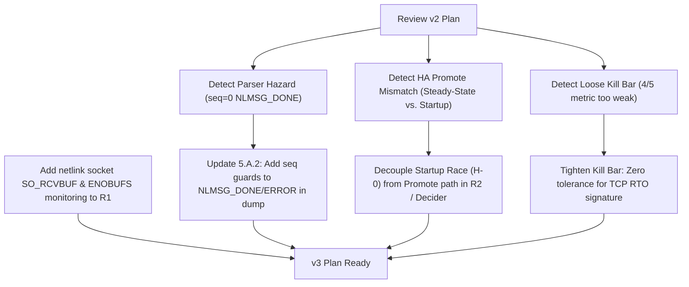

# Adversarial Review (v2 Research Plan) — #1648 Neighbor Race

This review hostilely inspects the v2 Research Plan (`plan.md` @ `research/1648-startup-neigh-race`) for hidden risks, structural race conditions, safety concerns in proposed fixes, and logical gaps.

---

## Executive Verdict: PLAN-NEEDS-REVISION

While the v2 plan significantly matures the understanding of the `seq=0` multicast drop during the initial dump, it suffers from a **fundamental conceptual paradox** regarding the HA failover promote path, introduces **critical parser vulnerabilities** in the proposed `5.A.2` fix, and uses a **dangerously loose quantitative kill-bar** that could silence a genuine production bug. 

The plan must be revised to address these showstoppers before moving to `/engineer`.

---

## 1. The Startup vs. Failover Paradox (Grave Conceptual Mismatch)
The plan states in **§5.D**:
> *"The failover and daemon-restart windows share the SAME root cause (seq=0 multicast drop during the per-restart `initial_neighbor_dump`), so one fix covers both..."*

### The Counter-Example:
- `initial_neighbor_dump` is invoked **exactly once** during the initialization of `neigh_monitor_thread` at daemon startup ([neighbor.rs:514](file:///home/ps/git/bpfrx/.claude/worktrees/1648-research-startup-race/userspace-dp/src/afxdp/neighbor.rs#L514)).
- In a standard production HA failover, the standby node (`fw1`) has already been running continuously. Its daemon `xpfd` is NOT restarted upon promotion; instead, it is promoted in-place via a control socket call that executes `on_rg_promote_active()` ([ha.rs:89-165](file:///home/ps/git/bpfrx/.claude/worktrees/1648-research-startup-race/userspace-dp/src/afxdp/ha.rs#L89-L165)).
- Therefore, at the moment of promotion, `neigh_monitor_thread` on the newly-promoted primary is **already in its steady-state loop** ([neighbor.rs:526-556](file:///home/ps/git/bpfrx/.claude/worktrees/1648-research-startup-race/userspace-dp/src/afxdp/neighbor.rs#L526-L556)).
- In this steady-state loop, it processes all messages of type `28` and `29` without any sequence-number validation ([neighbor.rs:544-550](file:///home/ps/git/bpfrx/.claude/worktrees/1648-research-startup-race/userspace-dp/src/afxdp/neighbor.rs#L544-L550)). Multicast `seq=0` messages are processed immediately and are **never dropped**.

### Critical Impact:
If a `~1.7s` first-connect latency is actually observed post-failover (World 1), **the H-0 multicast-drop bug in `initial_neighbor_dump` cannot be the cause.** Shipping `5.A.2` (the startup dump fix) will do absolutely nothing to resolve the post-failover latency.
- If World 1 is real, the failover latency must be caused by a missing connected-route prewarming mechanism (§2.3) combined with a broken or rate-limited steady-state probe path.
- If World 2 is real (failover first-connect is ≤200ms because steady-state resolution takes ~5ms), then the `~1.7s` is a **startup-only artifact** and the HA promote path has no issue.
- **Action Required:** Revise §5.D and §7 to explicitly decouple the startup-only bug (H-0) from the failover promoter analysis. The test matrix in R2 must verify if failover has any latency *independent* of H-0.

---

## 2. Safety & Parser Vulnerability in Fix `5.A.2`
The plan proposes allowing `seq=0` multicast messages to be parsed during `initial_neighbor_dump` by removing the sequence number check continue-branch ([plan.md:301-309](file:///home/ps/git/bpfrx/.claude/worktrees/1648-research-startup-race/docs/research/1648-startup-neigh-race/plan.md#L301-L309)).

### The Hazard:
If `initial_neighbor_dump` is modified to process `nlmsg_seq == 0` messages, they will fall through to the `match nlmsg_type` block:
```rust
438:                 match nlmsg_type {
439:                     NLMSG_DONE => {
440:                         dump_done = true;
441:                     }
442:                     NLMSG_ERROR => {
443:                         return Err(io::Error::other("netlink neighbor dump failed"));
444:                     }
```
If a multicast netlink message with `seq == 0` happens to carry `NLMSG_DONE` or `NLMSG_ERROR` (e.g. from an asynchronous error or unrelated netlink activity), the dump loop will **either terminate prematurely (`dump_done = true`) or fail entirely with an error.**

### The Fix for the Fix:
To make `5.A.2` safe, the parser must guard the loop termination and error conditions using an explicit sequence match:
```rust
                    NLMSG_DONE if nlmsg_seq == next_seq => {
                        dump_done = true;
                    }
                    NLMSG_ERROR if nlmsg_seq == next_seq => {
                        return Err(io::Error::other("netlink neighbor dump failed"));
                    }
```
*Note: The NUD state guard at [neighbor.rs:349-353](file:///home/ps/git/bpfrx/.claude/worktrees/1648-research-startup-race/userspace-dp/src/afxdp/neighbor.rs#L349-L353) is safe against stale `seq=0` deletions. Because netlink socket buffers are strict FIFO, any multicast event queued before/during the dump represents an older state than the subsequent dump entries, meaning the newer dump entries will correctly overwrite and restore any valid state, keeping the datastore eventually consistent.*

---

## 3. Dangerous Looseness in the Quantitative Kill Bar
The plan establishes a kill bar in **§4 R2**:
> *"If R2 first-connect for the on-link targets after a clean failover (including the aged-standby case) is ≤200ms in ≥4 of 5 trials, both v4 and v6, then failover is NOT affected → PLAN-KILL."*

### Why this is unsafe:
- The neighbor-dump race is a classical timing race condition. Depending on VM scheduling, CPU load, and network conditions, it might reproduce with a lower probability (e.g., 20%).
- If the bug has a 20% reproduction rate, the probability of seeing 1 failure out of 5 trials is high (~67%), but it is highly likely that 4 out of 5 trials will succeed (≤200ms).
- Under the current bar, a **4/5 success rate triggers a PLAN-KILL**, silencing a critical bug that degrades failover performance for 20% of customer failover events!
- **Action Required:** Tighten the bar. There must be **zero tolerance** for any trial exhibiting the `~1.7s` duplicate-SYN TCP RTO signature. If even *one* trial hits the RTO signature, the bug is present, and PLAN-KILL must be rejected.

---

## 4. Missing Operational Failure Mode: Netlink Socket Buffer Overflow (`ENOBUFS`)
The plan overlooks a critical operational risk for standby nodes. 

### The Mechanism:
- The netlink socket is bound to `RTMGRP_NEIGH` at startup and continuously queues multicast neighbor updates.
- The daemon does **not** set a custom receive buffer size (`SO_RCVBUF`), defaulting to the kernel system limit (typically small).
- On a standby node that carries no active data plane traffic, the socket receive queue can easily fill up during periods of high network activity or routing churn.
- When the buffer overflows, subsequent reads on the socket will fail with `ENOBUFS` (`105`).
- In the `recv()` loop at [neighbor.rs:528](file:///home/ps/git/bpfrx/.claude/worktrees/1648-research-startup-race/userspace-dp/src/afxdp/neighbor.rs#L528), any error `n <= 0` (including `ENOBUFS` returned as `-1`) is **silently ignored via `continue`**.
- This leaves the standby node's userspace map **permanently desynchronized** from the kernel table without any re-sync mechanism. When the node promotes, it is virtually guaranteed to hit stale or missing neighbor entries.

### Recommendation:
Include throwaway instrumentation in **R1** to monitor for `ENOBUFS` on the netlink socket, and consider adding a fallback `initial_neighbor_dump` re-sync or a large socket buffer (`SO_RCVBUF`) to the fix candidates.

---

## 5. HA-Failover Safety: Gating and VRRP Budget
The plan correctly identifies the need to prevent any blocking operations on the promote path. Since `initial_neighbor_dump` is only executed at startup, the proposed changes to the dump parser (`5.A.2`) represent **zero risk** to the `~60ms` VRRP budget. 

However, if R2 proves World 1 is real (post-failover latency exists), any fix that modifies the promote path (e.g. extending `queue_warm_pass` toconnected routes) must be asynchronously enqueued to avoid regression.

---

## 6. Summary of Action Items for v3 Research Plan



1. **Decouple H-0 from VRRP failover**: Acknowledge that `initial_neighbor_dump` is startup-only. Focus R2 on proving whether the steady-state resolution path under promote states behaves correctly.
2. **Secure `5.A.2`**: Update the implementation plan to explicitly guard loop termination (`NLMSG_DONE`/`NLMSG_ERROR`) with `nlmsg_seq == next_seq`.
3. **Tighten the Kill Bar**: Change the bar to `5/5` ≤ 200ms, with absolute rejection of PLAN-KILL if a single duplicate-SYN signature is captured.
4. **Address `ENOBUFS`**: Add netlink queue buffer overflow checks to the R1 instrumentation phase.
